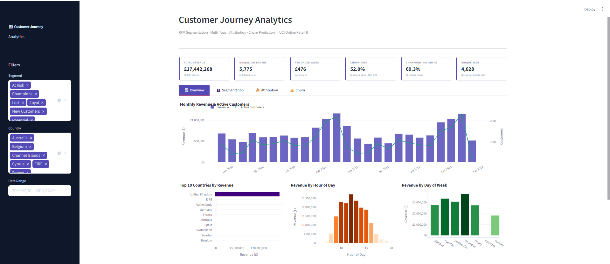
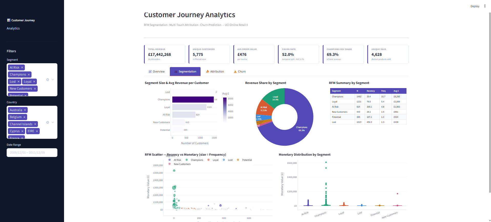
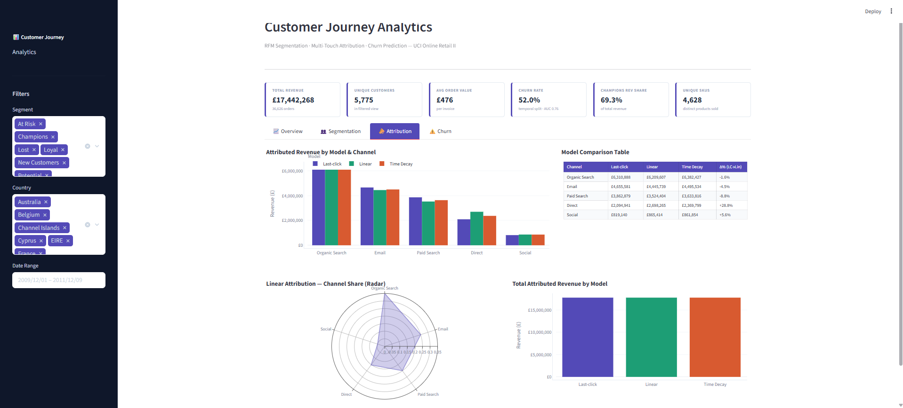
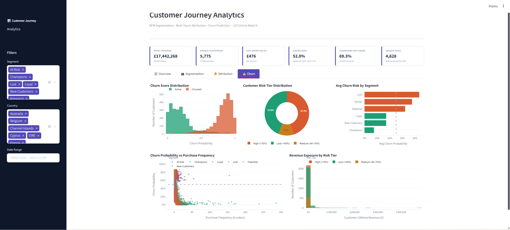

# Customer Journey Analytics

End-to-end marketing analytics pipeline built on the UCI Online Retail II dataset.
Covers RFM-based customer segmentation, multi-touch attribution modeling, and churn prediction — with an interactive Streamlit dashboard.

---

## Why I Built This Project

I built this project to bridge my performance marketing experience with customer-level data analysis.
Since the original dataset does not include campaign or channel-level data, I used the transactional records for RFM segmentation and churn modeling, and added a simulated attribution layer to demonstrate how marketing channels would be evaluated in a real GA4 or CRM setup.
The goal was to show how marketing decisions — budget allocation, retention targeting, channel prioritization — can be grounded in data.

---

## Dashboard Preview






---

## Project Structure

```
customer-journey-analytics/
│
├── assets/                      # Dashboard screenshots
├── data/                        # Data folder (excluded from version control — see .gitignore)
├── eda.py                       # Exploratory data analysis & cleaning
├── rfm_segmentation.py          # RFM scoring and customer segmentation
├── attribution.py               # Multi-touch attribution modeling
├── churn.py                     # Churn prediction (Random Forest)
├── dashboard.py                 # Interactive Streamlit dashboard
└── requirements.txt
```

---

## Dataset

**UCI Online Retail II** — Real transactional data from a UK-based online retailer (2009–2011).  
~1M rows, 8 columns: Invoice, StockCode, Description, Quantity, InvoiceDate, Price, Customer ID, Country.

Source: [UCI Machine Learning Repository](https://archive.ics.uci.edu/dataset/502/online+retail+ii)  
Download the dataset and place `online_retail_II.csv` inside the `data/` folder before running.

---

## Methodology

### 1. EDA & Data Cleaning
- Removed transactions with missing Customer IDs (~23% of raw data)
- Filtered cancelled invoices (prefix `C`) and negative quantities
- Engineered `TotalPrice = Quantity × Price`
- Final clean dataset: ~805K rows, 5,878 unique customers

### 2. RFM Segmentation
- Computed Recency, Frequency, and Monetary value per customer
- Scored each dimension 1–5 using quintile-based binning
- Assigned customers to six behavioral segments:
  - **Champions** · **Loyal** · **At Risk** · **Lost** · **New Customers** · **Potential**
- Segment labels were assigned using heuristic RFM rules. In a real business setting, these thresholds should be validated with CRM teams, campaign outcomes, and retention behavior.
- Key finding: Champions represent ~25% of customers but drive **69.3% of total revenue**

### 3. Multi-Touch Attribution
- Simulated customer touchpoint journeys across five channels: Organic Search · Email · Paid Search · Direct · Social
- Implemented and compared three attribution models:
  - **Last-click** — full credit to the final touchpoint
  - **Linear** — equal credit across all touchpoints
  - **Time Decay** — exponentially higher weight on recent touches
- Since traffic channel data is not available in the original dataset, channel paths were simulated to demonstrate attribution logic. Channel-level findings should be interpreted as methodological examples rather than real marketing insights.

### 4. Churn Prediction
- Defined churn using a **temporal split**: customers active in the first 75% of the time window were labeled churned if they did not purchase in the final 25%
- Trained a **Random Forest classifier** on behavioral features: Frequency, Monetary, Avg Order Value, Unique Products, Avg Quantity, Purchase Interval Std
- Intentionally excluded Recency from features to avoid data leakage
- **ROC-AUC: 0.755** on held-out test set
- The model is intended as a baseline churn classifier. Future iterations should include precision/recall trade-offs, confusion matrix analysis, and threshold tuning for retention campaign targeting.

---

## Key Findings

| Metric | Value |
|---|---:|
| Total Revenue | £17.7M |
| Unique Customers | 5,878 |
| Champions Revenue Share | 69.3% |
| Churn Rate | 52.0% |
| Churn Model AUC | 0.755 |
| Avg Order Value | £476 |

- **Pareto effect is extreme**: top ~25% of customers generate ~70% of revenue
- **B2B buying behavior**: peak transactions between 10:00–14:00 on weekdays
- **Attribution models compared** across simulated channels — findings reflect methodology, not real traffic data
- **- **Direct channel appears underweighted** in last-click — linear attribution assigns it a larger mid-funnel share, though this reflects simulated data
- **High churn risk** concentrated in Lost and At Risk segments, which together represent ~£2.3M in historical revenue

---

## Dashboard

Built with Streamlit and Plotly. Four interactive tabs:

- **Overview** — Revenue trends, top products, hourly/daily patterns, MoM growth
- **Segmentation** — RFM scatter, segment distribution, revenue share, box plots
- **Attribution** — Model comparison across channels, radar chart, delta table
- **Churn** — Score distribution, risk tiers, segment-level risk, revenue exposure

**Run locally:**

```bash
pip install -r requirements.txt
streamlit run dashboard.py
```

---

## How to Reproduce

1. Download the dataset from [UCI Machine Learning Repository](https://archive.ics.uci.edu/dataset/502/online+retail+ii)
2. Place `online_retail_II.csv` inside the `data/` folder
3. Run the pipeline in order:

```bash
python eda.py
python rfm_segmentation.py
python attribution.py
python churn.py
streamlit run dashboard.py
```

---

## Tech Stack

| Tool | Purpose |
|---|---|
| Python 3.13 | Core language |
| pandas | Data manipulation |
| scikit-learn | Machine learning |
| Plotly | Interactive visualizations |
| Streamlit | Dashboard framework |

---

## Limitations & Next Steps

- Attribution channel data is simulated — real implementation requires GA4 or CRM integration
- RFM segment thresholds are heuristic and would benefit from business validation
- Churn model could be improved with additional features such as product categories and return rates
- Deployment to Streamlit Cloud would make the dashboard publicly accessible